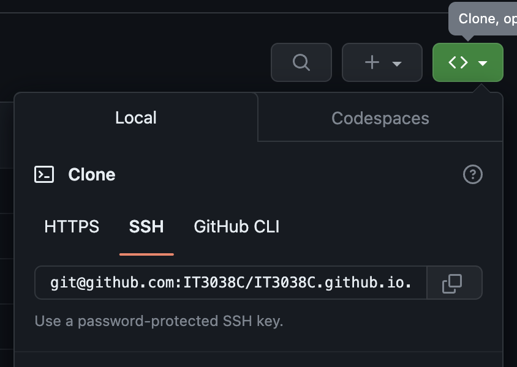

Open <https://github.com>

If you already have an account, feel free to use that one. If not, click "Sign up for GitHub".
Create an account using your UC email address and create a username, for example, I will register with <reedws@mail.uc.edu> and username reedws.


If you've never used Github, this is a great opportunity to get familiar with how it works. You can create the initial README.md file to say a little about yourself. Just click the green "Continue" button and start editing.


If you already have a Github.com account, you can create a new Repository with the same name as your username, then create the README.md file within to update your Github homepage.

(Optional step) As students of UC, you can get GitHub Pro for free by visiting this link: <https://education.github.com/pack>

:::note
GitHub no longer allows you to sign in with your username and password from the git command line
:::

## SSH Keys

SSH keys are a way to authenticate with GitHub without having to enter your username and password every time you push or pull from a repository. It's a little more secure than using a username and password, and it's also more convenient.

To create an SSH key, open a terminal and run the following command:

```bash
ssh-keygen -t ed25519 -C "username@mail.uc.edu"
```

Press enter repeatedly until you see this output:

```
Your identification has been saved in .../id_ed25519
Your public key has been saved in .../id_ed25519.pub
The key fingerprint is:
SHA256:... username@mail.uc.edu
The key's randomart image is:
```

Now print the SSH key to your terminal and copy it to your clipboard:

```bash
cat ~/.ssh/id_ed25519.pub
```

Lastly, go to <https://github.com/settings/keys> and add your new SSH key

Now when you clone a repository, you can use the SSH URL instead of the HTTPS URL.


